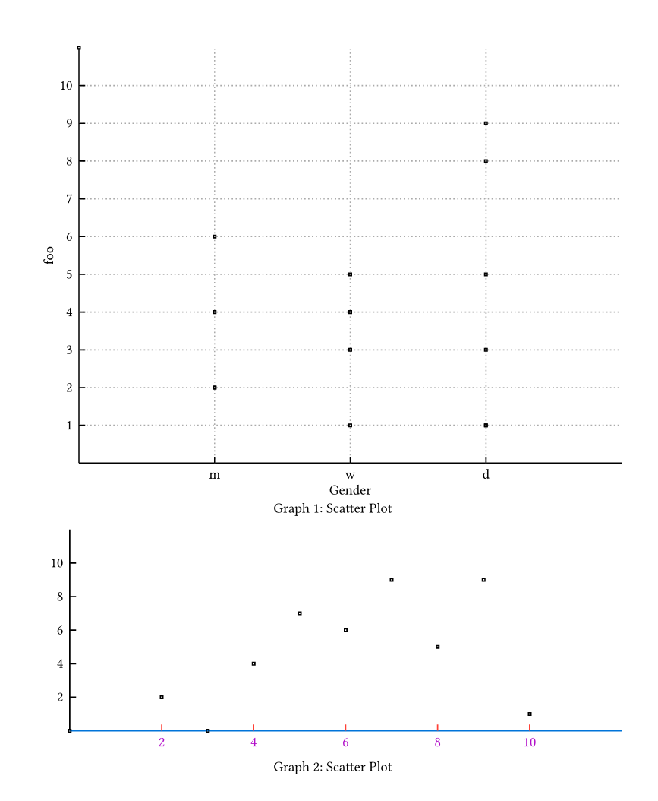

# A plotting library for Typst

A Typst library for drawing graphs and plots.
Made by Gewi413 and Pegacraffft

## Currently supported graphs

- Scatter plots

- Graph charts

- Histograms

- Bar charts

- Pie charts

  (more to come)

## How to use

The documentation is found in the [Docs.pdf](https://github.com/Pegacraft/typst-plotting/blob/master/Docs.pdf). It contains all functions necessary to use this library.

If you need some example code, check out [main.typ](https://github.com/Pegacraft/typst-plotting/blob/master/main.typ).

## Images

### Scatter plots

### Graph charts

### Histograms

### Bar charts

### Pie charts

